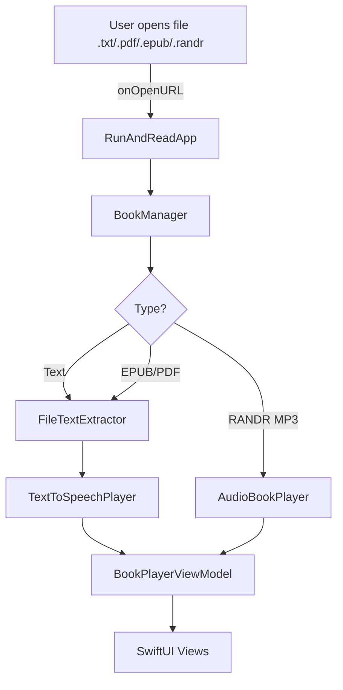

[](https://developer.apple.com/ios/)
[](https://swift.org)
[](https://developer.apple.com/xcode/swiftui/)
[](LICENSE)

**Related Projects:** [Run&Read Studio](https://github.com/sergenes/runandread-studio) | [Android Version](https://github.com/answersolutionsapps/runandread-android) | [Audiobook Pipeline](https://github.com/sergenes/runandread-audiobook)

Text‑to‑Speech and audiobook player for iPhone and iPad — listen to your books while running, exercising, or on the go.


Run & Read is a distraction‑free Text‑to‑Speech (TTS) and audiobook player designed for reading while moving. Open text, PDF, or EPUB files and let the app read them aloud using system voices, with speed control and background audio.

- Clean SwiftUI interface
- System Text‑to‑Speech with voice and speed selection
- Background audio playback (keep listening with the screen off)
- Supports .txt, .pdf, .epub, and a custom `.randr` archive
- Open from the Files app and other apps via the share sheet

## Installation

### From the App Store
**App Store**: [Run & Read for Apple Devices](https://apps.apple.com/us/app/run-read-listen-on-the-go/id6741396289)

### From Google Play
**Google Play**: [Run & Read for Android](https://play.google.com/store/apps/details?id=com.answersolutions.runandread)

**Scan QR codes to download**

<div align="center">
  &nbsp;&nbsp;&nbsp;
  
</div>

### Build from source

- Requirements:
  - Xcode 15+
  - iOS 16+ deployment target (configurable)
  - Swift 5.9+
- Steps:
  1. Clone the repository:
     ```
     git clone https://github.com/answersolutions/runandread-ios.git
     ```
  2. Open `RunAndRead.xcodeproj` in Xcode.
  3. Select the `RunAndRead` scheme and build/run on a device or simulator.

## Usage
- Open the app, tap the + button or use the Files app to share a document to Run & Read.
- Choose a voice and speed in Settings.
- Control playback from the Player screen; background audio is supported.

## Features
- Text‑to‑Speech using system voices (AVSpeechSynthesizer)
- Audiobook playback (.mp3 via RANDR pipeline)
- Adjustable speed and voice selection
- Horizontally scrolling text reader
- Open files from the Files app or share sheet
- Background audio support

## Architecture
See the high‑level overview in [docs/ARCHITECTURE.md](docs/ARCHITECTURE.md).




## Dependencies

Runtime libraries (Swift Package Manager):
- Zip — https://github.com/marmelroy/Zip — used for working with `.randr` archives and other zip containers.
- EPUBKit — https://github.com/witekbobrowski/EPUBKit — EPUB parsing utilities (container + manifest).
- AEXML — https://github.com/tadija/AEXML — lightweight XML parser used by EPUB parsing flow.
- SwiftSoup — https://github.com/scinfu/SwiftSoup — HTML/XHTML parsing and text extraction for EPUB content.

Notes:
- These libraries are open‑source and compatible with MIT distribution of this app. See each project for license details.
- Some packages may include or depend on additional components (e.g., XML/ZIP helpers) managed by SwiftPM.

Related project (optional pipeline):
- RunAndRead‑Audiobook — https://github.com/sergenes/runandread-audiobook — an open‑source pipeline for generating MP3 audiobooks (e.g., using Zyphra/Zonos). Run & Read can play MP3s produced by this pipeline. See the [RANDR instructions](https://github.com/sergenes/runandread-audiobook/blob/main/RANDR.md).

## Privacy
Run & Read does not collect analytics or personal data. All processing happens on‑device. Files you open remain on your device unless you choose to share/export them.

## Contributing
Contributions are welcome! Please open an issue to discuss changes or submit a pull request. See coding guidelines in [docs/ARCHITECTURE.md](docs/ARCHITECTURE.md).

## Contact
- **[Sergey N](https://www.linkedin.com/in/sergey-neskoromny/)**

## License
This project is licensed under the MIT License — see the [LICENSE](LICENSE) file for details.
