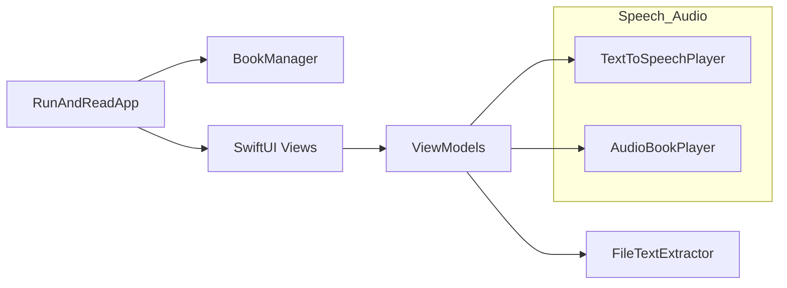
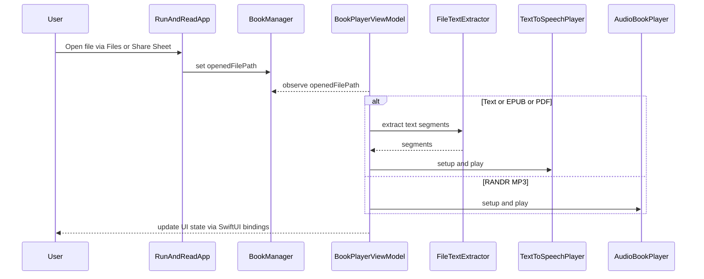
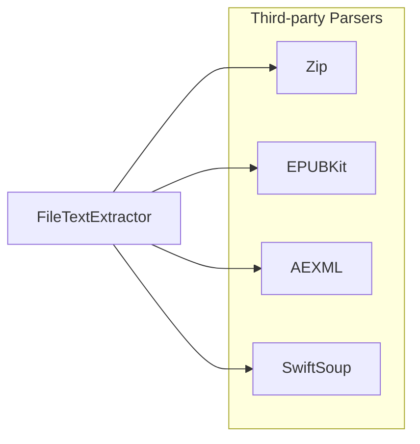

# RunAndRead iOS — Architecture Overview

This document provides a high‑level overview of the app architecture to help new contributors navigate the codebase quickly.

## Goals
- Smooth, distraction‑free reading while moving (running or walking), via Text‑to‑Speech and audio.
- Simple, maintainable layers with clear responsibilities.
- Offline‑friendly where possible; no backend dependencies.

## High‑Level Diagram

## Layers and Modules

1. App Layer
   - Entry point: `RunAndReadApp` (SwiftUI `@main`)
   - Dependency wiring via `EnvironmentObject` for core services:
     - `BookManager` (file management and opened file path)
     - `SimpleTTSPlayer`, `TextToSpeechPlayer` (system TTS)
     - `AudioBookPlayer` (audio playback for audiobooks)
   - Handles incoming file URLs via `onOpenURL`.

2. UI (SwiftUI Views)
   - `UI/Init/` — `SplashScreenView` (initialization / first launch surface)
   - `UI/Home/` — Home screen and book list (`HomeScreenView`, `BookItemView`)
   - `UI/BookPlayer/` — Player screen and controls (`BookPlayerView`)
   - `UI/BookSettings/` — Reading and playback settings (`BookSettingsView`)
   - `UI/Components/` — Reusable UI elements (buttons, pickers, modifiers, activity indicator, horizontally scrolled text, etc.)
   - `UI/About/` — About screen

   Views bind to ViewModels via `@StateObject` or `@ObservedObject`, reacting to published state.

3. ViewModels
   - `HomeScreenViewModel`, `BookPlayerViewModel`, `BookSettingsViewModel`.
   - Own UI state, orchestrate use‑cases, and coordinate with services (TTS or audio, file manager, models).
   - Expose intents/actions (play or pause, speed change, voice selection, open file, add bookmark).

4. Models
   - `Book`, `AudioBook` — model structs representing domain entities used across ViewModels and services.

5. File & Data Layer
   - `Files/BookManager` — tracks current opened file path and basic book management state.
   - `Files/FileTextExtractor` — loads or extracts text from various supported document types (plain text, PDF, EPUB) for TTS playback.

6. Speech and Audio Layer
   - `Speech/SimpleTTSPlayer` — thin wrapper around AVSpeechSynthesizer for straightforward TTS needs.
   - `Speech/TextToSpeechPlayer` — richer TTS engine controller for rate, pitch, language or voice selection, paging segments, and lifecycle events.
   - `Speech/SpeechSpeedSelector` — encapsulates logic for allowed speeds.
   - `Audio/AudioBookPlayer` — playback for prerecorded audiobooks.
   - `Speech/AudioSessionManager` — configures and manages AVAudioSession (category, interruptions, background audio).

7. App Utilities
   - `App/EmailService` — opens prefilled email compose for feedback or logs, can attach exported audio files.
   - `App/Extensions` — app‑wide extensions or helpers.
   - `App/TimeLogger`, `App/UIConfig` — diagnostic logging and UI styling tokens.

## Data Flow

## Threading and Concurrency
- UI updates occur on the main thread as required by SwiftUI.
- Long‑running or I/O tasks (file reading or parsing) are dispatched off the main thread where applicable.
- AVFoundation callbacks may arrive on internal queues; state is marshaled back to the main thread for UI.

## Routing and Deep Links
- `onOpenURL` in `RunAndReadApp` handles `.randr`, `.txt`, `.epub`, `.pdf` file types configured in `Info.plist`.
- Security‑scoped resource access is used when necessary for Files app or external locations.

## Permissions
- Background audio enabled (Info.plist `UIBackgroundModes: audio`).
- No network access by default; the app does not store or transmit personal data.

## Dependencies
- System frameworks: SwiftUI, AVFoundation, UIKit (for some integrations like `SKStoreReviewController`).
- Third‑party libraries (Swift Package Manager):
  - Zip — https://github.com/marmelroy/Zip — unzip/zip support for `.randr` archives and other containers.
  - EPUBKit — https://github.com/witekbobrowski/EPUBKit — EPUB container + manifest parsing.
  - AEXML — https://github.com/tadija/AEXML — XML parsing used within the EPUB flow.
  - SwiftSoup — https://github.com/scinfu/SwiftSoup — HTML/XHTML parsing to extract readable text from EPUB content.

Notes:
- Licenses are compatible with MIT; see each project for details and versions pinned in `Package.resolved`.
- These libraries are used only for on‑device parsing; no analytics or tracking SDKs are included.

## Testing
- `RunAndReadTests` contains unit tests for core logic such as book parsing. Consider adding tests for ViewModels and text extraction segments.

## Extensibility
- Add new document types by extending `FileTextExtractor`.
- Add new TTS voices or languages through `AVSpeechSynthesisVoice` discovery in `TextToSpeechPlayer`.
- Introduce analytics or crash reporting behind an optional feature flag, ensuring opt‑in and privacy safeguards.

## Folder Map (Quick Reference)
- App entry and utilities: `RunAndRead/App/`
- Assets: `RunAndRead/Assets.xcassets/`
- Models: `RunAndRead/Model/`
- Files and parsing: `RunAndRead/Files/`
- Speech and Audio: `RunAndRead/Speech/`, `RunAndRead/Audio/`
- UI: `RunAndRead/UI/`
- Tests: `RunAndReadTests/`

## Coding Guidelines
- Swift API Design Guidelines and SwiftUI best practices.
- Use meaningful names; avoid abbreviations.
- Prefer `struct` for value types; use `class` where reference semantics or Objective‑C interop is required.
- Keep Views small and composable; put logic in ViewModels or services.
- Document public types and important methods.
